# **Mixamo-Blender-4-Plugin**  

## **So einfach geht's:**  

Diese Version herunterladen als ZIP dann umbenennen mixamo_blender4-main.zip in mixamo_blender4.zip dann als externes Add-on installieren.

In der V12 sind umfangreiche Reparaturfunktionen hinzugekommen.

## 🦴 Neue Bento Konvertierungswerkzeuge

Erweitertes Rig-Konvertierungssystem mit erweiterten Pose-Steuerungen für Bento-kompatible Armatures.

## Funktionen

### Pose-Anwendungssystem

🎯 **Präzise Steuerung**:

- **Handpose**  
    
  Anwendung spezifischer Handposen mit Links/Rechts-Umschaltung:

  ```python
  apply_left_hand = BoolProperty(default=True)
  apply_right_hand = BoolProperty(default=True)
  ```

- **Vollständige Bento-Pose**  
    
  Ein-Klick-Anwendung für Ganzkörperposen:

  ```python
  operator("object.apply_bento_data")
  ```

### Erweiterte Steuerungen

⚙️ **Detaillierte Anpassung**:

```python
# Transformationskomponenten umschalten
apply_position = BoolProperty(default=True)
apply_rotation = BoolProperty(default=True)
apply_scale = BoolProperty(default=False)
```

### Rig-Werkzeuge

🛠️ **Armature-Verarbeitung**:

| Werkzeug | Operator | Icon | Beschreibung |
|----------|----------|------|-------------|
| Rig konvertieren | `rename_mixamo_bones` |  | Vollständige Mixamo→Bento-Umwandlung |
| Parenting korrigieren | `auto_parenting` |  | Repariert Knochenhierarchien |
| Bone Rolls fixieren | `fix_bone_roll` |  | Standardisiert Knochenausrichtungen |
| Pose zurücksetzen | `apply_rest_pose` |  | Rückkehr zur Standard-T-Pose |

## UI-Struktur

```mermaid
graph TD
    B[Bento-Konvertierung] --> P[Pose-Anwendung]
    B --> T[Rig-Werkzeuge]
    P --> H[Handpose]
    P --> F[Vollständige Bento-Pose]
    P --> A[Erweiterte Optionen]
    H --> L[Links/Rechts-Umschaltung]
    A --> X[Position/Rotation/Skalierung]
    T --> C[Konvertieren]
    T --> FP[Parenting korrigieren]
    T --> FR[Bone Rolls fixieren]
```



## Anwendungsbeispiel

```python
# Nur linke Handpose anwenden
bpy.ops.object.apply_hand_data(apply_left_hand=True, apply_right_hand=False)

# Kompletter Bento-Konvertierungsprozess
bpy.ops.object.rename_mixamo_bones()
bpy.ops.object.fix_bone_roll()
bpy.ops.object.apply_bento_data()
```

> **Hinweis**: Alle Pose-Operationen funktionieren im **Edit-Modus** und **Pose-Modus** mit vollständiger Undo-Unterstützung.


Based on: https://www.adobe.com/products/substance3d/plugins/mixamo-in-blender.html
